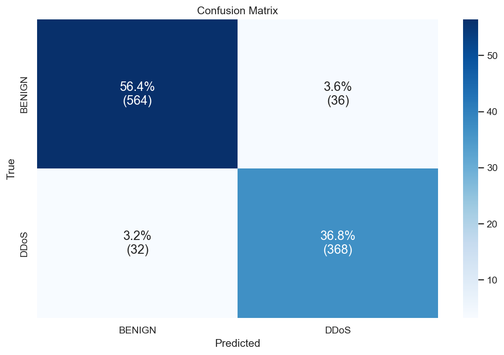
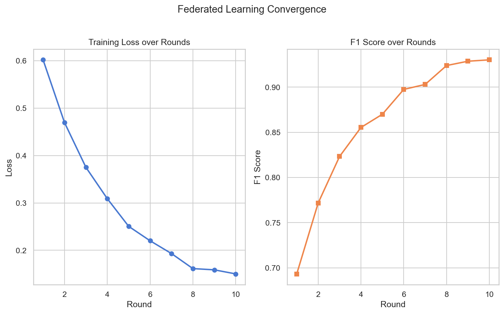

# 6G Federated IDS

Privacy-preserving Intrusion Detection System using Federated Learning for 6G edge networks.
A federated MLP classifier detects DDoS attacks on the CICIDS2017 dataset without any client
sharing raw network traffic data. Each edge node trains locally on its IID partition, and only
model weight updates are aggregated via the FedAvg algorithm using the Flower framework.

## Architecture Overview

The system follows a three-stage pipeline:

1. **Data Preprocessing** -- Load the CICIDS2017 CSV, apply domain-informed feature selection
   (44-feature shortlist, near-constant removal, correlation filtering), normalize with
   StandardScaler, split into train/test sets, and partition training data across federated
   clients using stratified IID sharding.

2. **Federated Training** -- Each client trains a local MLP model on its partition for a
   configurable number of local epochs. After each round, the Flower server aggregates client
   weights via FedAvg. The process repeats for a configurable number of rounds. TensorBoard
   logs global metrics per round.

3. **Evaluation** -- The final global model is evaluated on the held-out test set. Outputs
   include a confusion matrix, convergence plot, per-client comparison chart, and a full
   classification report.

## Prerequisites

- **Python 3.11+** (3.11 or 3.12 recommended)
- **Disk space:** ~2 GB for the CICIDS2017 dataset and generated outputs
- **GPU:** Optional. CUDA and MPS are auto-detected; falls back to CPU if unavailable

## Setup

### Installation

```bash
git clone https://github.com/<your-org>/6g-federated-ids.git
cd 6g-federated-ids
```

Create and activate a virtual environment:

```bash
# Linux / macOS
python -m venv .venv
source .venv/bin/activate

# Windows (cmd)
python -m venv .venv
.venv\Scripts\activate

# Windows (Git Bash)
python -m venv .venv
source .venv/Scripts/activate
```

Install the project with development dependencies:

```bash
pip install -e ".[dev]"
```

This installs all runtime dependencies (PyTorch, Flower, pandas, scikit-learn, matplotlib,
TensorBoard) and dev tools (pytest, ruff).

## Data Download

This project uses the **CICIDS2017** dataset from the University of New Brunswick Canadian
Institute for Cybersecurity.

1. Visit: <https://www.unb.ca/cic/datasets/ids-2017.html>
2. Navigate to the **MachineLearningCSV** download section
3. Download: `Friday-WorkingHours-Afternoon-DDos.pcap_ISCX.csv`
4. Place the file in `data/raw/`:

```
data/
  raw/
    Friday-WorkingHours-Afternoon-DDos.pcap_ISCX.csv
```

The file is approximately 77 MB with ~225,000 rows containing BENIGN traffic and DDoS attack
samples.

## Quick Start

The primary way to run the full experiment is the **`federated-ids-run-all`** command. It
chains all three pipeline stages (preprocessing, federated training, evaluation) in sequence:

```bash
federated-ids-run-all
```

With a custom configuration file:

```bash
federated-ids-run-all --config path/to/config.yaml
```

This single command takes the project from raw CSV data to final evaluation plots and metrics.

## Individual Stage Commands

Each pipeline stage can also be run independently:

| Command | Description |
|---------|-------------|
| `federated-ids-preprocess` | Load raw CSV, select features, normalize, split, and partition data |
| `federated-ids-train` | Standalone (non-federated) local model training for baseline comparison |
| `federated-ids-train-fl` | Federated training with Flower (FedAvg aggregation across clients) |
| `federated-ids-evaluate` | Evaluate the global model and generate plots and reports |
| `federated-ids-run-all` | Run the full pipeline: preprocess, federated train, evaluate |

Example -- run only federated training with CLI overrides:

```bash
federated-ids-train-fl --num-clients 5 --num-rounds 30
```

## Configuration

All hyperparameters are centralized in `config/default.yaml` for reproducibility. The
configuration is organized into four sections:

### Data Section (`data`)

| Parameter | Default | Description |
|-----------|---------|-------------|
| `raw_dir` | `./data/raw` | Directory containing the raw CICIDS2017 CSV |
| `processed_dir` | `./data/processed` | Output directory for preprocessed artifacts |
| `test_size` | `0.2` | Fraction held out as global test set before partitioning |
| `target_features` | `30` | Informational target for feature count after selection |
| `correlation_threshold` | `0.95` | Drop one feature from pairs with \|r\| above this |
| `variance_threshold` | `1e-10` | Drop near-constant features below this variance |

### Model Section (`model`)

| Parameter | Default | Description |
|-----------|---------|-------------|
| `hidden_layers` | `[128, 64, 32]` | MLP hidden layer sizes (decreasing width) |
| `dropout` | `0.3` | Dropout probability after each hidden layer |
| `num_classes` | `2` | Binary classification: BENIGN (0) vs DDoS (1) |

### Training Section (`training`)

| Parameter | Default | Description |
|-----------|---------|-------------|
| `learning_rate` | `0.001` | Adam optimizer learning rate |
| `local_epochs` | `1` | Local training epochs per federated round |
| `batch_size` | `64` | Mini-batch size for DataLoaders |
| `weighted_loss` | `true` | Use class-weighted cross-entropy for imbalance handling |
| `standalone_epochs` | `5` | Epochs for standalone (non-federated) training |
| `val_split` | `0.2` | Validation split fraction for standalone training |

### Federation Section (`federation`)

| Parameter | Default | Description |
|-----------|---------|-------------|
| `num_clients` | `3` | Number of simulated federated clients |
| `num_rounds` | `20` | Number of FedAvg aggregation rounds |
| `fraction_fit` | `1.0` | Fraction of clients participating per round |

### Global Settings

| Parameter | Default | Description |
|-----------|---------|-------------|
| `seed` | `42` | Global random seed (random, numpy, torch, CUDA) |
| `output_dir` | `./outputs` | Directory for all output artifacts |
| `log_level` | `INFO` | Logging verbosity: DEBUG, INFO, WARNING, ERROR |

Environment variable interpolation is supported via `${VAR_NAME:-default}` syntax in the
YAML file (e.g., `${DATA_DIR:-./data}`, `${OUTPUT_DIR:-./outputs}`).

## Output Structure

After a complete pipeline run, the `outputs/` directory contains:

```
outputs/
  checkpoints/
    global_model.pt           # Final aggregated global model weights
  metrics/
    fl_metrics.json           # Per-round training metrics with full config snapshot
  plots/
    confusion_matrix.png      # Test set confusion matrix (total-based percentages)
    convergence.png           # F1 and loss convergence across federated rounds
    client_comparison.png     # Per-client vs global model performance comparison
    classification_report.txt # Precision, recall, F1 per class
  tensorboard/                # TensorBoard event files for real-time monitoring
```

## Results

The plots below are generated from a run with the default configuration (3 clients, 20
rounds, MLP with layers [128, 64, 32]):





> **Note:** To generate these screenshots, run the full pipeline once with real data, then
> copy the output plots to the `docs/` folder:
>
> ```bash
> mkdir -p docs
> cp outputs/plots/confusion_matrix.png docs/
> cp outputs/plots/convergence.png docs/
> ```

## TensorBoard

To view real-time training metrics during or after federated training:

```bash
tensorboard --logdir outputs/tensorboard
```

Then open <http://localhost:6006> in your browser. If port 6006 is in use, specify a
different port:

```bash
tensorboard --logdir outputs/tensorboard --port 6007
```

## Running Tests

Run the full test suite (uses synthetic data fixtures, no real dataset required):

```bash
python -m pytest tests/ -v
```

Run only the integration test (marked as slow):

```bash
python -m pytest tests/test_integration.py -v
```

Skip slow tests:

```bash
python -m pytest tests/ -v -m "not slow"
```

## Troubleshooting

### Missing CSV files

**Symptom:** Error about missing files in `data/raw/`.

**Fix:** Download the CICIDS2017 Friday DDoS CSV from the
[UNB CICIDS2017 page](https://www.unb.ca/cic/datasets/ids-2017.html) and place it in
`data/raw/Friday-WorkingHours-Afternoon-DDos.pcap_ISCX.csv`. See the
[Data Download](#data-download) section.

### CUDA out of memory

**Symptom:** `RuntimeError: CUDA out of memory` during training.

**Fix:** Reduce the batch size or model size in `config/default.yaml`:

```yaml
training:
  batch_size: 32        # reduce from 64

model:
  hidden_layers: [64, 32]  # reduce from [128, 64, 32]
```

Alternatively, force CPU training by setting the `CUDA_VISIBLE_DEVICES` environment variable:

```bash
CUDA_VISIBLE_DEVICES="" federated-ids-run-all
```

### TensorBoard port conflicts

**Symptom:** `TensorBoard could not bind to port 6006`.

**Fix:** Use a different port:

```bash
tensorboard --logdir outputs/tensorboard --port 6007
```

### Python version incompatibility

**Symptom:** Import errors or syntax errors on startup.

**Fix:** This project requires Python 3.11 or later. Check your version:

```bash
python --version
```

If you have multiple Python versions installed, ensure your virtual environment uses 3.11+:

```bash
python3.11 -m venv .venv
```

## Project Structure

```
src/federated_ids/
    __init__.py             # Package root
    config.py               # YAML config loading with env var interpolation
    seed.py                 # Global seed setting for reproducibility
    device.py               # Auto-detect CUDA/MPS/CPU device
    pipeline.py             # End-to-end pipeline runner (run-all entry point)
    data/
        __init__.py         # Convenience imports
        __main__.py         # python -m federated_ids.data entry point
        loader.py           # CICIDS2017 CSV loading and cleaning
        preprocess.py       # Feature selection, normalization, train/test split
        partition.py        # IID stratified partitioning and DataLoader creation
    model/
        __init__.py         # Convenience imports
        model.py            # MLP model definition (dynamic hidden layers)
        train.py            # Standalone training loop with validation and checkpointing
    fl/
        __init__.py         # Convenience imports
        __main__.py         # Federated training entry point
        client.py           # Flower NumPyClient implementation
        server.py           # FedAvg server configuration and FL loop
    eval/
        __init__.py         # Convenience imports
        __main__.py         # Evaluation entry point
        evaluate.py         # Model evaluation with detailed metrics
        plots.py            # Confusion matrix, convergence, and comparison plots
config/
    default.yaml            # Default configuration (all hyperparameters)
tests/
    conftest.py             # Shared test fixtures (synthetic data)
    test_config.py          # Config loading tests
    test_loader.py          # Data loader tests
    test_preprocess.py      # Preprocessing tests
    test_partition.py       # Partitioning and DataLoader tests
    test_model.py           # MLP model tests
    test_train.py           # Standalone training tests
    test_fl.py              # Federated learning tests
    test_eval.py            # Evaluation and plotting tests
    test_integration.py     # End-to-end integration test (slow)
```
